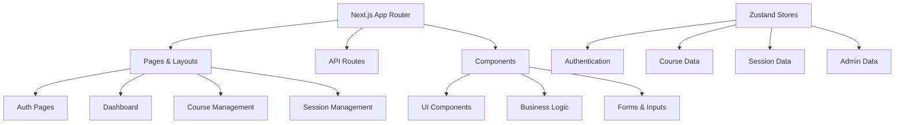
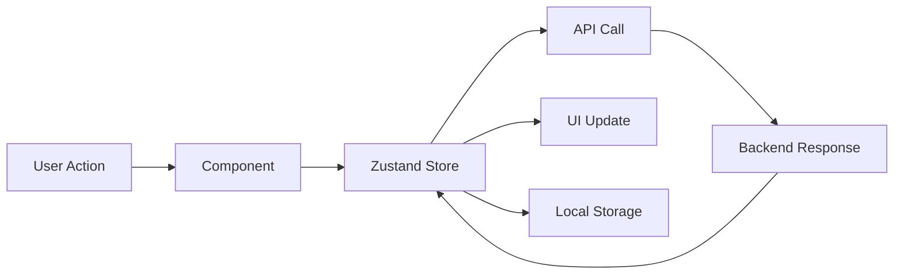
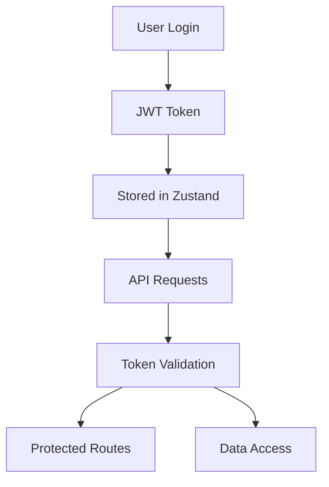

# UniTrack - Comprehensive Attendance Management System

<div align="center">
  
  
  <p align="center">
    <strong>A modern, GPS-verified attendance management system for educational institutions</strong>
  </p>

  <p align="center">
    <a href="#features">Features</a> •
    <a href="#technology-stack">Tech Stack</a> •
    <a href="#installation">Installation</a> •
    <a href="#usage">Usage</a> •
    <a href="#api-documentation">API</a> •
    <a href="#contributing">Contributing</a>
  </p>

  <p align="center">
    
    
    
    
    
  </p>
</div>

---

## 📋 Table of Contents

- [Overview](#overview)
- [✨ Features](#features)
- [🚀 Technology Stack](#technology-stack)
- [📁 Project Structure](#project-structure)
- [⚙️ Installation](#installation)
- [🔧 Configuration](#configuration)
- [📖 Usage](#usage)
- [🏗️ Architecture](#architecture)
- [🔐 Security Features](#security-features)
- [📱 Mobile-First Design](#mobile-first-design)
- [🗺️ Location Services](#location-services)
- [👨‍💼 User Roles](#user-roles)
- [📊 State Management](#state-management)
- [🎨 UI Components](#ui-components)
- [📈 Analytics & Reporting](#analytics--reporting)
- [🌐 API Integration](#api-integration)
- [🔄 Development Workflow](#development-workflow)
- [🧪 Testing](#testing)
- [🚀 Deployment](#deployment)
- [📚 API Documentation](#api-documentation)
- [🤝 Contributing](#contributing)
- [📄 License](#license)

---

## Overview

**UniTrack** is a comprehensive, GPS-verified attendance management system designed specifically for educational institutions. Built with modern web technologies, it provides real-time attendance tracking, location verification, device fingerprinting, and comprehensive reporting features.

### 🎯 Key Objectives

- **Accurate Attendance**: GPS-based location verification with configurable radius zones
- **Security**: Device fingerprinting and advanced fraud prevention
- **User Experience**: Mobile-first design with intuitive interfaces
- **Scalability**: Built to handle large educational institutions
- **Flexibility**: Configurable settings for various classroom scenarios

---

## ✨ Features

### 🎓 **For Students**

- **Mobile-First Interface**: Optimized for smartphones and tablets
- **GPS Verification**: Location-based attendance submission
- **Real-time Feedback**: Instant attendance confirmation
- **Session Codes**: Simple 4-digit codes for quick access
- **Offline Support**: Queue submissions when network is unavailable

### 👨‍🏫 **For Lecturers**

- **Interactive Map**: Satellite view with radius visualization
- **Flexible Radius**: 5m to 1000m range for various scenarios
- **Live Sessions**: Real-time attendance monitoring
- **Bulk Management**: Mass student uploads and management
- **Detailed Reports**: PDF generation with comprehensive analytics
- **Course Management**: Multiple course handling with enrollment tracking

### 👨‍💼 **For Administrators**

- **System Overview**: Comprehensive dashboard with key metrics
- **User Management**: Create and manage lecturer accounts
- **Audit Logs**: Complete system activity tracking
- **Analytics**: Detailed statistics and performance metrics
- **Health Monitoring**: System status and performance tracking
- **Semester Management**: End-of-semester cleanup tools

### 🔒 **Security Features**

- **Device Fingerprinting**: FingerprintJS integration for device identification
- **Location Verification**: High-accuracy GPS validation
- **Session Management**: Secure token-based authentication
- **Fraud Prevention**: Multiple layers of security checks
- **Data Encryption**: End-to-end secure data transmission

---

## 🚀 Technology Stack

### **Frontend Framework**

- **Next.js 15.4.3**: React framework with App Router
- **React 19.1.1**: Modern React with latest features
- **TypeScript 5**: Full type safety and IntelliSense

### **Styling & UI**

- **Tailwind CSS 4.0.12**: Utility-first CSS framework
- **Radix UI**: Accessible component primitives
- **Lucide React**: Beautiful SVG icons
- **Framer Motion**: Smooth animations and transitions

### **State Management**

- **Zustand 5.0.8**: Lightweight state management
- **Persistence**: Local storage integration
- **Real-time Updates**: Live data synchronization

### **Mapping & Location**

- **React-Leaflet**: Interactive maps with satellite view
- **Leaflet**: Open-source mapping library
- **GPS Integration**: High-accuracy location services

### **Data & Analytics**

- **Recharts**: Beautiful charts and analytics
- **Date-fns**: Modern date manipulation
- **PDF Generation**: jsPDF with auto-table support

### **Security & Identification**

- **FingerprintJS**: Advanced device fingerprinting
- **JWT Tokens**: Secure authentication
- **Device Detection**: Mobile/tablet identification

### **Developer Experience**

- **ESLint**: Code linting and formatting
- **Prettier**: Code formatting
- **PostCSS**: CSS processing
- **Auto-import**: Organized import management

---

## 📁 Project Structure

```
UniTrack/
├── 📁 app/                          # Next.js App Router
│   ├── 🔐 auth/                     # Authentication pages
│   │   ├── forgot-password/
│   │   ├── reset-password/
│   │   ├── signin/
│   │   ├── signup/
│   │   └── verify-code/
│   ├── 📊 dashboard/                # Main dashboard
│   ├── 📚 course/                   # Course management
│   │   ├── [courseId]/             # Dynamic course pages
│   │   ├── create/                 # Course creation
│   │   └── report/                 # Course reports
│   ├── 📅 session/                  # Session management
│   │   ├── [sessionId]/            # Dynamic session pages
│   │   └── start/                  # Session creation
│   ├── 👥 students/                 # Student management
│   ├── 📝 submit/                   # Attendance submission
│   ├── 👨‍💼 lecturers/                # Admin lecturer management
│   ├── 🔄 share-students/           # Student sharing system
│   ├── 👤 profile/                  # User profile management
│   ├── ❓ help/                     # Help and support
│   ├── 📈 stats/                    # System statistics
│   ├── 🔍 audit-logs/              # System audit logs
│   ├── ❤️ health/                   # System health monitoring
│   └── 🗑️ semester-cleanup/         # End of semester tools
├── 📁 components/                   # Reusable UI components
│   ├── 🔐 Auth/                     # Authentication components
│   ├── 🗺️ ui/                       # Core UI components
│   ├── 📋 Landing/                  # Landing page components
│   ├── 🎨 logos/                    # Brand assets
│   ├── 📐 layouts/                  # Layout components
│   └── 🎯 contexts/                 # React contexts
├── 📁 lib/                          # Utility libraries
│   ├── utils.ts                    # General utilities
│   ├── fonts.ts                    # Font configurations
│   ├── pdf-generator.ts            # PDF generation
│   └── device-utils.ts             # Device detection
├── 📁 store/                        # Zustand state management
│   ├── auth-store.ts               # Authentication state
│   ├── course-store.ts             # Course management state
│   ├── session-store.ts            # Session management state
│   ├── admin-store.ts              # Admin functionality state
│   ├── profile-store.ts            # User profile state
│   ├── help-store.ts               # Help system state
│   ├── notification-store.ts       # Notification state
│   └── student-share-store.ts      # Student sharing state
├── 📁 config/                       # Configuration files
│   └── site.ts                     # Site configuration
├── 📁 styles/                       # Global styles
│   └── utils.css                   # Utility styles
├── 📁 public/                       # Static assets
├── 📁 docs/                         # Documentation
└── 📄 Configuration files
    ├── package.json                # Dependencies
    ├── tailwind.config.ts          # Tailwind configuration
    ├── tsconfig.json               # TypeScript configuration
    ├── next.config.mjs             # Next.js configuration
    ├── components.json             # UI component configuration
    └── eslint.config.mjs           # ESLint configuration
```

---

## ⚙️ Installation

### Prerequisites

- **Node.js**: Version 18 or higher
- **npm**: Version 8 or higher
- **Git**: For version control

### Step-by-step Installation

1. **Clone the Repository**

   ```bash
   git clone https://github.com/BiodunDevv/UniTrack.git
   cd UniTrack
   ```

2. **Install Dependencies**

   ```bash
   npm install
   ```

3. **Environment Configuration**

   ```bash
   cp .env.example .env.local
   ```

4. **Configure Environment Variables**

   ```env
   # API Configuration
   NEXT_PUBLIC_API_BASE_URL=http://localhost:5000/api

   # Authentication
   NEXT_PUBLIC_JWT_SECRET=your-jwt-secret

   # Map Configuration
   NEXT_PUBLIC_MAPS_API_KEY=your-maps-api-key

   # Database (Backend)
   MONGODB_URI=mongodb://localhost:27017/unitrack

   # Email Configuration (Backend)
   SMTP_HOST=smtp.gmail.com
   SMTP_PORT=587
   SMTP_USER=your-email@gmail.com
   SMTP_PASS=your-app-password
   ```

5. **Start Development Server**

   ```bash
   npm run dev
   ```

6. **Build for Production**
   ```bash
   npm run build
   npm start
   ```

---

## 🔧 Configuration

### Site Configuration

Edit `config/site.ts` to customize your installation:

```typescript
export const siteConfig = {
  name: "UniTrack",
  url: "https://yourdomain.com",
  description: "Your institution's attendance management system",
  stats: {
    institutions: 1,
    students: 1000,
    sessions: 5000,
    // ... other stats
  },
  links: {
    github: "https://github.com/yourusername/unitrack",
    email: "mailto:admin@yourinstitution.edu",
  },
};
```

### Tailwind Configuration

The `tailwind.config.ts` file contains custom theme configurations:

- **Color Schemes**: Light and dark mode support
- **Component Variants**: Custom button, card, and form styles
- **Animations**: Smooth transitions and micro-interactions
- **Typography**: Optimized font scales and spacing

### Component Configuration

The `components.json` file configures the UI component library:

- **Base Styles**: Foundation for all components
- **Component Aliases**: Import path shortcuts
- **Utility Functions**: Helper functions for styling

---

## 📖 Usage

### 🎓 **Student Workflow**

1. **Access Submission Page**

   - Visit `/submit` on mobile device
   - Enter matric number, level, and session code

2. **Location Verification**

   - Grant location permissions
   - Ensure you're within the attendance radius
   - Submit attendance

3. **Confirmation**
   - Receive instant feedback
   - Get attendance receipt
   - View submission status

### 👨‍🏫 **Lecturer Workflow**

1. **Course Management**

   - Create and manage courses
   - Upload student lists (CSV format)
   - Set course details and enrollment

2. **Session Creation**

   - Start new attendance session
   - Set location and radius (5m - 1000m)
   - Configure session duration
   - Monitor attendance in real-time

3. **Attendance Monitoring**

   - View live attendance submissions
   - See student locations on map
   - Manually mark attendance if needed
   - End session when complete

4. **Reporting**
   - Generate detailed PDF reports
   - Export attendance data
   - View analytics and trends

### 👨‍💼 **Administrator Workflow**

1. **System Management**

   - Create lecturer accounts
   - Monitor system health
   - View audit logs
   - Manage system settings

2. **Analytics**

   - View institution-wide statistics
   - Monitor usage patterns
   - Track system performance
   - Generate administrative reports

3. **Maintenance**
   - End-of-semester cleanup
   - Database maintenance
   - User management
   - System monitoring

---

## 🏗️ Architecture

### **Frontend Architecture**



### **State Management Flow**



### **Security Flow**



---

## 🔐 Security Features

### **Authentication & Authorization**

- **JWT Tokens**: Secure, stateless authentication
- **Role-Based Access**: Admin, Lecturer, Student permissions
- **Session Management**: Automatic token refresh and expiry
- **Protected Routes**: AuthGuard component for route protection

### **Device Security**

- **FingerprintJS Integration**: Advanced device fingerprinting
- **Device Information**: Platform, browser, screen resolution tracking
- **Unique Identifiers**: Visitor ID and confidence scoring
- **Fallback Mechanisms**: Simple hash generation when FingerprintJS fails

### **Location Security**

- **High-Accuracy GPS**: Precision location verification
- **Radius Validation**: Server-side distance calculation
- **Location Accuracy**: Quality indicators and thresholds
- **Fraud Prevention**: Multiple submission detection

### **Data Protection**

- **Input Validation**: Client and server-side validation
- **XSS Protection**: Sanitized inputs and outputs
- **CSRF Protection**: Token-based request validation
- **Secure Headers**: Content Security Policy and security headers

---

## 📱 Mobile-First Design

### **Responsive Breakpoints**

```css
/* Mobile First Approach */
sm: 640px    /* Small tablets */
md: 768px    /* Tablets */
lg: 1024px   /* Small laptops */
xl: 1280px   /* Desktops */
2xl: 1536px  /* Large screens */
```

### **Mobile Optimizations**

- **Touch-Friendly**: Large tap targets and touch gestures
- **Performance**: Optimized loading and minimal bundle size
- **Offline Support**: Service worker for offline functionality
- **Progressive Enhancement**: Features degrade gracefully

### **Device Detection**

```typescript
// Device utility functions
export const isMobileDevice = (): boolean => {
  // Mobile user agent detection
  // Screen size validation
  // Touch capability check
};

export const isTabletDevice = (): boolean => {
  // Tablet-specific detection
  // Screen size range validation
};
```

### **Mobile-Only Features**

- **Attendance Submission**: Restricted to mobile devices
- **GPS Accuracy**: Higher precision on mobile devices
- **Camera Integration**: Future QR code scanning support
- **Push Notifications**: Real-time attendance alerts

---

## 🗺️ Location Services

### **Interactive Maps**

- **Satellite View**: High-resolution Esri satellite imagery
- **Layer Control**: Switch between satellite, street, and hybrid views
- **Zoom Control**: Automatic zoom based on radius size
- **Marker Positioning**: Precise location indicators

### **Radius Visualization**

```typescript
// Accurate radius circles
<Circle
  center={position}
  radius={radius} // Exact meters
  pathOptions={{
    color: "#ffffff",
    fillColor: "#3b82f6",
    fillOpacity: 0.15,
  }}
/>
```

### **Radius Configuration**

- **Range**: 5 meters to 1000 meters
- **Presets**: Quick selection for common scenarios
- **Smart Recommendations**: Based on venue type
- **Visual Feedback**: Real-time radius visualization

### **Location Accuracy**

- **High Precision**: GPS with enableHighAccuracy
- **Accuracy Indicators**: Visual quality indicators
- **Timeout Handling**: Graceful fallbacks
- **Error Management**: User-friendly error messages

---

## 👨‍💼 User Roles

### **Student Role**

- **Limited Access**: Attendance submission only
- **Mobile Required**: Device restrictions for security
- **Session Codes**: Simple 4-digit access codes
- **Instant Feedback**: Real-time submission confirmation

### **Lecturer Role**

```typescript
interface LecturerPermissions {
  courses: ["create", "read", "update", "delete"];
  sessions: ["create", "read", "update", "end"];
  students: ["read", "upload", "manage"];
  reports: ["generate", "export", "view"];
}
```

### **Admin Role**

```typescript
interface AdminPermissions {
  users: ["create", "read", "update", "delete"];
  system: ["monitor", "configure", "maintain"];
  analytics: ["view", "export", "analyze"];
  audit: ["view", "export", "investigate"];
}
```

### **Role-Based Navigation**

- **Dynamic Menus**: Different navigation based on role
- **Permission Checks**: Component-level access control
- **Feature Flags**: Role-based feature availability
- **Security Boundaries**: Strict access enforcement

---

## 📊 State Management

### **Zustand Store Architecture**

```typescript
// Example: Course Store Structure
interface CourseState {
  // Data
  courses: Course[];
  currentCourse: Course | null;
  students: Student[];
  sessions: Session[];

  // UI State
  isLoading: boolean;
  error: string | null;
  pagination: Pagination | null;

  // Actions
  getAllCourses: () => Promise<void>;
  createCourse: (data: CreateCourseData) => Promise<void>;
  updateCourse: (id: string, data: UpdateCourseData) => Promise<void>;
  deleteCourse: (id: string) => Promise<void>;
}
```

### **Store Persistence**

```typescript
// Persistent storage configuration
export const useCourseStore = create<CourseState>()(
  persist(
    (set, get) => ({
      // Store implementation
    }),
    {
      name: "course-storage",
      storage: createJSONStorage(() => localStorage),
      partialize: (state) => ({
        // Only persist necessary data
        courses: state.courses,
        currentCourse: state.currentCourse,
      }),
    },
  ),
);
```

### **Store Communication**

- **Cross-Store Updates**: Stores can communicate with each other
- **Event-Driven**: Actions trigger updates across stores
- **Optimistic Updates**: Immediate UI updates with rollback
- **Error Handling**: Centralized error management

---

## 🎨 UI Components

### **Design System**

- **Radix UI**: Accessible component primitives
- **Custom Components**: Built on top of Radix
- **Consistent Styling**: Tailwind CSS utilities
- **Dark Mode**: Complete theme switching support

### **Component Categories**

#### **Form Components**

```typescript
// Example: Input Component
interface InputProps extends React.InputHTMLAttributes<HTMLInputElement> {
  label?: string;
  error?: string;
  helper?: string;
}
```

#### **Layout Components**

- **DashboardLayout**: Main application layout
- **AuthLayout**: Authentication page layout
- **Sidebar**: Navigation and quick actions
- **Header**: Top navigation and user actions

#### **Interactive Components**

- **Maps**: Leaflet-based location components
- **Modals**: Dialog and sheet components
- **Forms**: Validation and submission handling
- **Charts**: Recharts-based analytics

#### **Utility Components**

- **Loaders**: Loading states and skeletons
- **Badges**: Status and category indicators
- **Tooltips**: Contextual help and information
- **Notifications**: Toast and alert messages

---

## 📈 Analytics & Reporting

### **PDF Generation**

```typescript
// PDF report generation
export const generateAttendanceReport = (data: AttendanceData) => {
  const doc = new jsPDF();

  // Header with institution branding
  // Summary statistics
  // Detailed attendance table
  // Charts and visualizations

  return doc.save("attendance-report.pdf");
};
```

### **Chart Types**

- **Bar Charts**: Session attendance comparison
- **Line Charts**: Attendance trends over time
- **Pie Charts**: Status distribution
- **Area Charts**: Cumulative attendance data

### **Export Formats**

- **PDF Reports**: Detailed formatted reports
- **CSV Export**: Raw data for external analysis
- **Excel Files**: Structured data with formatting
- **JSON API**: Programmatic data access

### **Analytics Features**

- **Real-Time Dashboards**: Live attendance monitoring
- **Historical Analysis**: Trend analysis and patterns
- **Comparative Reports**: Cross-course comparisons
- **Predictive Insights**: Attendance pattern predictions

---

## 🌐 API Integration

### **Authentication Flow**

```typescript
// API authentication headers
const apiCall = async (endpoint: string, options: RequestInit = {}) => {
  const token = getAuthToken();

  const response = await fetch(`${API_BASE_URL}${endpoint}`, {
    headers: {
      "Content-Type": "application/json",
      ...(token && { Authorization: `Bearer ${token}` }),
      ...options.headers,
    },
    ...options,
  });

  return response.json();
};
```

### **Error Handling**

```typescript
// Centralized error handling
try {
  const data = await apiCall("/courses");
  set({ courses: data.courses, isLoading: false });
} catch (error) {
  set({
    error: error.message,
    isLoading: false,
    courses: [],
  });
}
```

### **API Endpoints**

#### **Authentication**

- `POST /auth/register_teacher` - Lecturer registration
- `POST /auth/login` - User login
- `POST /auth/verify_email` - Email verification
- `POST /auth/logout` - User logout

#### **Course Management**

- `GET /courses` - List courses
- `POST /courses` - Create course
- `GET /courses/:id` - Get course details
- `PUT /courses/:id` - Update course
- `DELETE /courses/:id` - Delete course

#### **Session Management**

- `POST /sessions` - Create session
- `GET /sessions/:id` - Get session details
- `PUT /sessions/:id/end` - End session
- `GET /sessions/:id/attendance` - Get attendance records

#### **Attendance**

- `POST /attendance/submit` - Submit attendance
- `GET /attendance/session/:id` - Get session attendance
- `POST /attendance/manual` - Manual attendance marking

---

## 🔄 Development Workflow

### **Git Workflow**

```bash
# Feature development
git checkout -b feature/new-feature
git add .
git commit -m "feat: add new feature"
git push origin feature/new-feature

# Create pull request
# Code review and testing
# Merge to main branch
```

### **Code Quality**

```bash
# Linting
npm run lint

# Type checking
npm run type-check

# Formatting
npm run format

# Testing
npm run test
```

### **Build Process**

```bash
# Development build
npm run dev

# Production build
npm run build

# Analyze bundle
npm run analyze

# Start production server
npm start
```

### **Environment Management**

- **Development**: `.env.local`
- **Staging**: `.env.staging`
- **Production**: `.env.production`
- **Testing**: `.env.test`

---

## 🧪 Testing

### **Testing Strategy**

- **Unit Tests**: Component and utility testing
- **Integration Tests**: API and store testing
- **E2E Tests**: Full user workflow testing
- **Accessibility Tests**: WCAG compliance testing

### **Testing Tools**

```json
{
  "@testing-library/react": "Component testing",
  "@testing-library/jest-dom": "DOM testing utilities",
  "jest": "Test runner and framework",
  "cypress": "E2E testing",
  "axe-core": "Accessibility testing"
}
```

### **Test Organization**

```
tests/
├── unit/
│   ├── components/
│   ├── utils/
│   └── stores/
├── integration/
│   ├── api/
│   └── workflows/
├── e2e/
│   ├── auth.spec.ts
│   ├── courses.spec.ts
│   └── sessions.spec.ts
└── fixtures/
    ├── users.json
    ├── courses.json
    └── sessions.json
```

---

## 🚀 Deployment

### **Platform Options**

#### **Vercel (Recommended)**

```bash
# Install Vercel CLI
npm i -g vercel

# Deploy
vercel --prod
```

#### **Netlify**

```bash
# Build and deploy
npm run build
netlify deploy --prod --dir=.next
```

#### **Docker**

```dockerfile
FROM node:18-alpine
WORKDIR /app
COPY package*.json ./
RUN npm ci --only=production
COPY . .
RUN npm run build
EXPOSE 3000
CMD ["npm", "start"]
```

### **Environment Variables**

```bash
# Production environment
NEXT_PUBLIC_API_BASE_URL=https://api.yourdomain.com
NEXT_PUBLIC_ENVIRONMENT=production
NEXT_PUBLIC_MAPS_API_KEY=your-production-api-key
```

### **Performance Optimization**

- **Image Optimization**: Next.js Image component
- **Code Splitting**: Automatic route-based splitting
- **Bundle Analysis**: webpack-bundle-analyzer
- **Caching**: Static asset and API response caching

---

## 📚 API Documentation

### **Backend Repository**

The backend for this system was developed separately. Key features include:

- **Node.js/Express**: RESTful API server
- **MongoDB**: Database with Mongoose ODM
- **JWT Authentication**: Secure token-based auth
- **Email Services**: OTP verification and notifications
- **File Upload**: CSV parsing and validation
- **Data Validation**: Joi schema validation
- **Rate Limiting**: API protection and throttling

### **Backend Endpoints**

#### **Core Features**

- User authentication and authorization
- Course and student management
- Session creation and monitoring
- Attendance submission and verification
- Real-time location validation
- Comprehensive audit logging

#### **Data Models**

- **User**: Authentication and profile data
- **Course**: Course information and enrollment
- **Session**: Attendance session data
- **Attendance**: Individual attendance records
- **AuditLog**: System activity tracking

---

## 🤝 Contributing

### **Development Setup**

1. Fork the repository
2. Create a feature branch
3. Install dependencies: `npm install`
4. Start development server: `npm run dev`
5. Make your changes
6. Run tests: `npm test`
7. Submit pull request

### **Code Standards**

- **TypeScript**: Full type safety required
- **ESLint**: Follow configured rules
- **Prettier**: Consistent code formatting
- **Conventional Commits**: Structured commit messages

### **Pull Request Process**

1. Update documentation if needed
2. Add tests for new features
3. Ensure all tests pass
4. Update CHANGELOG.md
5. Request code review

### **Issue Reporting**

- Use GitHub Issues for bug reports
- Provide detailed reproduction steps
- Include environment information
- Add relevant labels and assignees

---

## 📄 License

This project is licensed under the MIT License. See the [LICENSE](LICENSE) file for details.

---

## 📞 Support & Contact

- **Documentation**: [GitHub Wiki](https://github.com/BiodunDevv/UniTrack/wiki)
- **Issues**: [GitHub Issues](https://github.com/BiodunDevv/UniTrack/issues)
- **Discussions**: [GitHub Discussions](https://github.com/BiodunDevv/UniTrack/discussions)
- **Email**: [contact@unitrack.edu](mailto:contact@unitrack.edu)

---

## 🔄 Changelog

See [CHANGELOG.md](CHANGELOG.md) for detailed version history and updates.

---

## 🙏 Acknowledgments

- **Radix UI**: For accessible component primitives
- **Shadcn/ui**: For beautiful component designs
- **Leaflet**: For interactive mapping capabilities
- **FingerprintJS**: For device identification
- **Vercel**: For hosting and deployment
- **The Open Source Community**: For amazing tools and libraries

---

<div align="center">
  <p><strong>Built with ❤️ by the UniTrack Team</strong></p>
  <p>
    <a href="#top">Back to Top ↑</a>
  </p>
</div>
